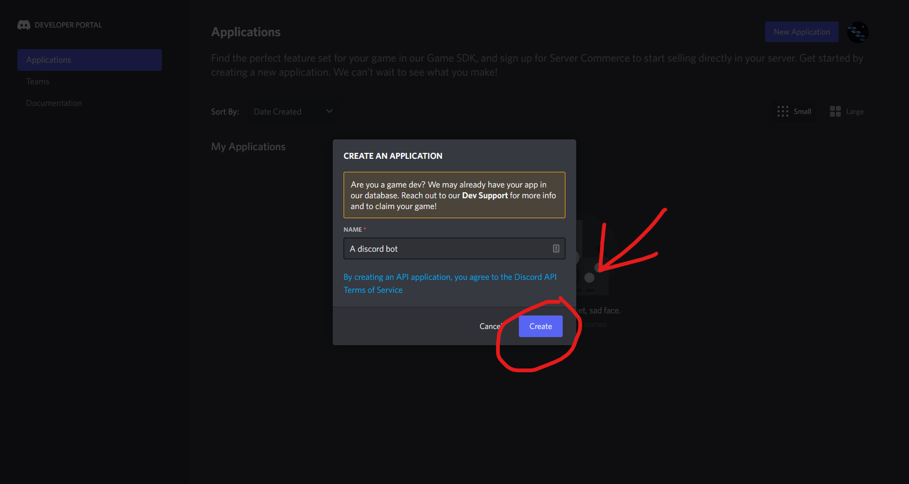
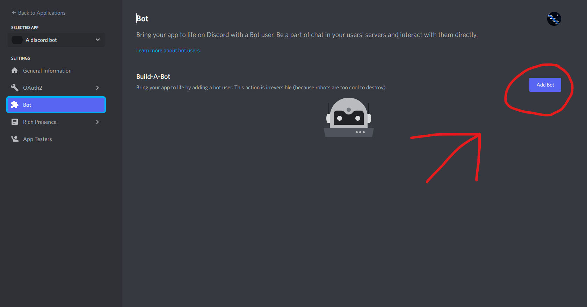
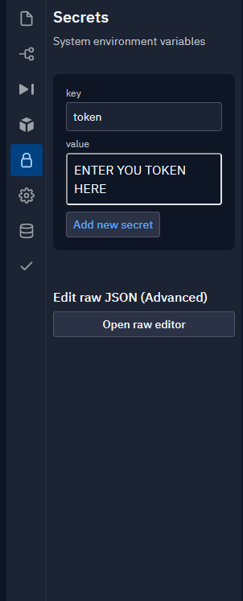

https://replit.com/@DeadCakeMix/Discordjs-V12-Template#index.js

This is a discord.js v12 template for https://replit.com
to use this template \
to create your discord bot go to https://discord.com/developers/applications and click the button titled "New Application"  Name your bot and click the button titled "Create"  look to your left and you should see a settings panel click the button titled "Bot"  click the button titled "Add Bot"  click the button titled "Yes, do it!"  click the button titled "Reset token"  click the button titled "Yes, do it!"  click the button titled "Copy" WARING THIS IS YOUR BOTS TOKEN DO NOT SHARE IT WITH ANYONE  Go back to replit and click the button on the left side with the lock icon  Inside the box titled "Key" enter "token" the "Key" needs to be named token inside the box titled "Value" past your token using CRT + V Click "Add new secret" go back to "index.js" and click the button tilted "Run"  CONGRATS YOU MADE YOUR FIRST BOT NOW INVITE TO YOUR SERVER AND TEST IT OUT! go back to https://discord.com/developers/applications and click your bot you made  on the left side click the button tilted "OAuth2" now click the button titled "URL Generator" click the square titled "Bot" scroll down and click the square titled "Administrator"  Click the button titled "Copy"  and you the link to invite your bot to your server and as you can see the bot is online Note: if you close this tab the bot will go offline

Now test out your new bot do "-ping" THE BOT WORKS pat yourself on the back and start editing the code to make your bot truly awsome you can find the Docs for discord.js here https://discord.js.org/#/docs/discord.js/stable/general/welcome